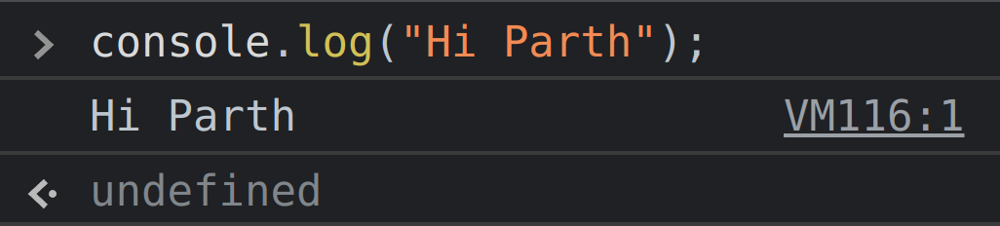
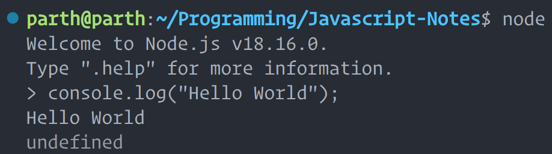
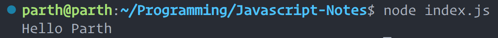

# `console.log()`

- Logs messages in the console.

```js
console.log("Hello World");
```

- You can either write the above line in browser console as follows:



- Or you can run the above code locally using nodejs as follows:



- Or you can create a Javascript file like `index.js` and type the above code in it and compile it with node as follows:


